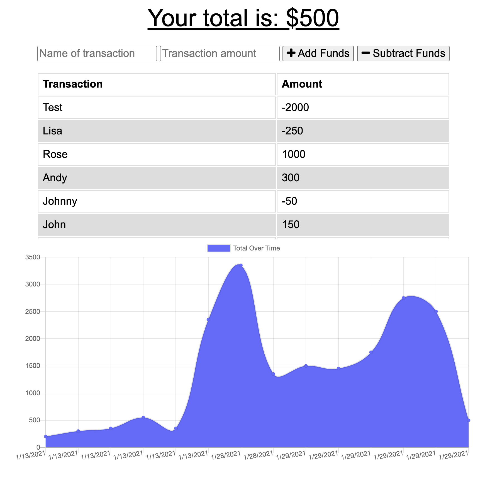

# Budget Tracker

## Description
An online/offline budget tracker! You can submit +/- transactions whether you're connected to the internet or not. 
<a href='https://budget-tracker-wh.herokuapp.com/'>Deployed Application</a>

## Table of Contents
* [Installation](#installation)
* [Usage](#usage)
* [License](#license)
* [Contributing](#contributing)
* [Tests](#tests)
* [Questions](#questions)

## Installation
To install the necessary dependencies, run the following command

`npm i`

## Usage

Just pull down the repo, install the dependencies, start it up and you can enter your transactions!

## License
This project is licensed under MIT

## Contributing
Go ahead and fork the repo and submit merge requests when ready to contribute

## Tests
To run tests, run the following command

`npm run test`

## Questions
If you have questions about the repo, open an issue or contact me directly at wharrison33@hotmail.com. You can find more of my work at willh33
  